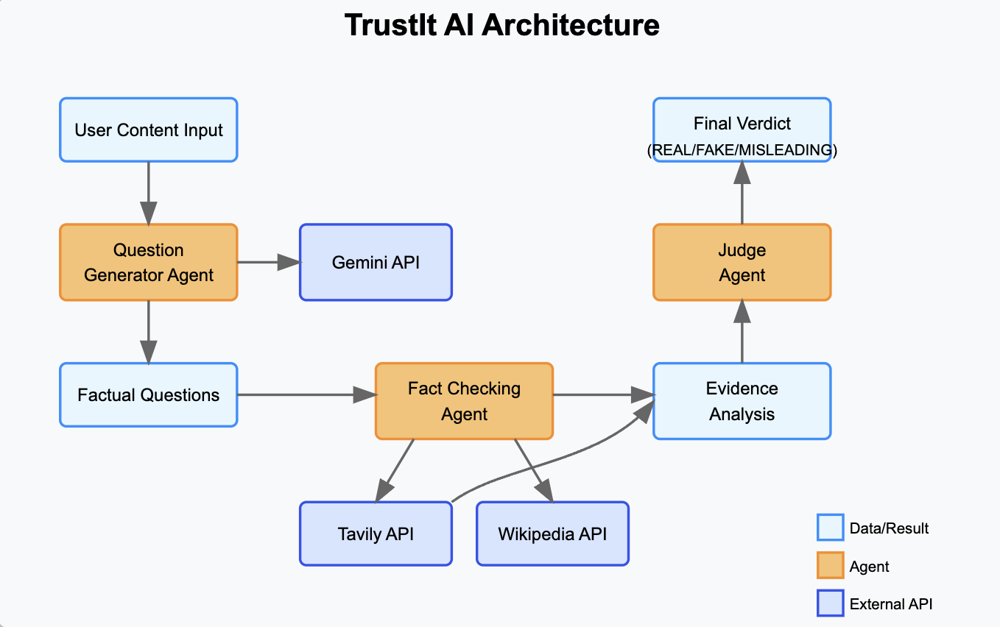

# TrustIt-AI: Trustworthy Search Application



## Project Description

TrustIt-AI is an advanced search application that evaluates and verifies the truthfulness of information. In an era of rampant misinformation, TrustIt-AI helps users distinguish between reliable facts and misleading content by conducting thorough fact-checking on search queries.

The application employs a multi-agent AI system powered by Portia to:
1. Analyze search queries and identify factual claims
2. Generate specific verification questions for each claim
3. Search for evidence across multiple reliable sources
4. Evaluate the credibility of found information
5. Provide a final judgment on the trustworthiness of content (REAL, MISLEADING, or FAKE)

## How Portia AI Was Used

TrustIt-AI leverages Portia's powerful AI orchestration capabilities to create a sophisticated fact-checking pipeline:

- **Multi-agent Planning**: Portia generates structured plans for decomposing complex fact-checking tasks into manageable steps
- **Tool Integration**: We integrated Tavily search API as a tool within Portia's framework, allowing for evidence gathering from the web
- **Execution Monitoring**: Portia's execution framework provides visibility into the LLM's reasoning process, creating more transparent fact-checking
- **Stateful Workflows**: Portia maintains context throughout the verification journey, ensuring coherent analysis across multiple subtasks

The application uses Portia to plan and execute the question generation phase, then conducts fact-checking using specialized agents, and finally renders judgment on content authenticity.

## Features

- Web search using Tavily's search API
- Agent-based search orchestration with Portia
- Real-time progress updates via Pusher
- Verification status for claims (VERIFIED, FALSE, PARTIALLY TRUE, UNCERTAIN)
- Confidence scoring for all judgments
- Source credibility evaluation
- Evidence presentation (supporting and contradicting)
- Modern, responsive UI for result visualization

## Setup

### Prerequisites

- Python 3.11 or higher
- API keys for:
  - Google Generative AI (Gemini)
  - Portia
  - Tavily

### Installation

1. Clone the repository

   ```
   git clone https://github.com/yourusername/TrustIt-AI.git
   cd TrustIt-AI
   ```

2. Set up a virtual environment

   ```
   python -m venv portia-env-py311
   
   # Activate the virtual environment:
   # On Linux/Mac:
   source backend/portia-env-py311/bin/activate
   # On Windows:
   portia-env-py311\Scripts\activate
   ```

4. Install dependencies

   ```
   pip install portia-sdk-python[google] fastapi tavily-sdk pusher
   ```

5. Create a `.env` file in the project root with the following API keys:
   ```
   GOOGLE_API_KEY=your_google_api_key
   PORTIA_API_KEY=your_portia_api_key
   TAVILY_API_KEY=your_tavily_api_key
   ```

## Running the Application

### Running the Backend Server

To start the backend server:

1. Make sure you have activated your virtual environment
   ```
   # On Linux/Mac:
   source backend/portia-env-py311/bin/activate
   # On Windows:
   portia-env-py311\Scripts\activate
   ```

2. Navigate to the project root and run:
   ```
   python -m backend.run
   ```
   or
   ```
   cd backend
   python run.py
   ```

The backend server will start on `http://localhost:8002`.

### Running the Frontend

1. Navigate to the frontend directory:
   ```
   cd frontend
   ```

2. Install frontend dependencies (first time only):
   ```
   npm install
   # or
   yarn install
   ```

3. Start the development server:
   ```
   npm run dev
   # or
   yarn dev
   ```

The frontend will be available at `http://localhost:3000`.

### Accessing the Application

Once both backend and frontend are running:
1. Open your browser and go to `http://localhost:3000`
2. Enter your search query in the search bar
3. View the trustworthiness analysis of the search results

## Architecture

The application follows a modular design with these key components:

- `backend/` - Main package
  - `server.py` - FastAPI server
  - `portia_integration.py` - Integration with Portia AI
  - `agents/` - Specialized agents for different tasks
    - `question_generator_agent.py` - Generates verification questions
    - `fact_checking_agent.py` - Verifies factual claims
    - `judge_agent.py` - Makes final authenticity judgment
  - `tools/` - Tool implementations
    - `tavily_search.py` - Tavily search tool
  
- `frontend/` - Next.js web application
  - Real-time updates via Pusher
  - Modern UI with responsive design

## Demo

The application demonstrates how AI orchestration with Portia can be used to create more reliable and transparent information verification systems. Users can input any content they want to verify, and TrustIt-AI will provide a detailed analysis of its trustworthiness, complete with supporting evidence and sources.

## Team

- [Team Member 1]
- [Team Member 2]
- [Team Member 3]


